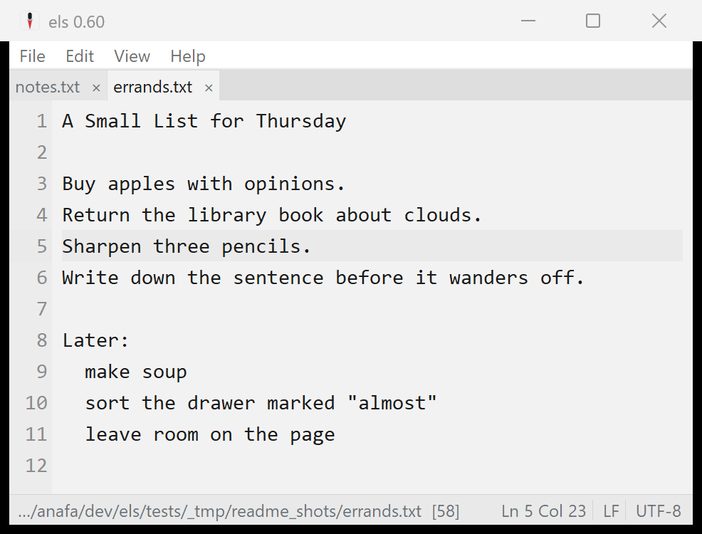
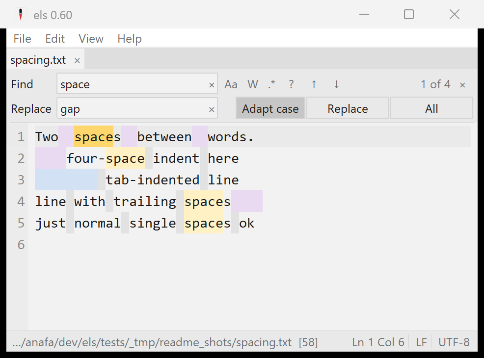

# els

A tiny text editor for Windows: calm, opinionated, no-frills.



els is a clean editor for everyday text files: multi-file tabs, find & replace
with real regex, word wrap, recent files, session restore, and charset
auto-detection across 95 encodings. It is built to never lose your text:
saves are atomic, unsaved work is continuously crash-protected, and opening a
file while els is running joins the existing window instead of spawning a
second one (see [Data safety](#data-safety)). The look is deliberately quiet:
a calm grey page, flat chrome, and a single precise caret. It ships as a
self-contained native **`els.exe`** (~5.1 MB, zero non-system dependencies): a
real Windows executable with Tcl/Tk 9 and its C23 extensions compiled in.

The design is opinionated to the point of having few knobs: settings exist only
where they protect flow, such as wrap, recents, session restore, and where to
keep `els.conf`. The full rationale (palette, typography, the find/replace
design, explicit non-goals) is in
[`docs/DESIGN.md`](docs/DESIGN.md), drawn from a study of EditPad Pro, Sublime
Text, Zed and iA Writer.

## Download

Grab the latest **`els.exe`** from the [Releases](../../releases) page. It's one
file, nothing to install. It's unsigned, so Windows SmartScreen may warn on
first launch: choose **More info → Run anyway**.

To make els open `.txt` and other plain-text files, open **Help > File
Associations...** and click **Register els with Windows**. That puts els in
Explorer's **Open with** menu (and in Settings > Default apps) without ever
seizing a default. Then right-click a file, pick **Open with > els**, and tick
**Always** to make it the default for that type. Manage or reset defaults anytime
in **Settings > Default apps**.

## Features

- **Data safety, built in**: atomic saves that cannot truncate a file,
  continuous crash protection for unsaved changes, and one editor window that
  collects everything you open. Explained in [Data safety](#data-safety).
- **Multi-file tabs**: each document keeps its own undo, selection and dirty
  state under a flat tab strip; drag a tab to reorder.
- **Find & replace** (Ctrl+F / Ctrl+H): Tcl ARE regex with live match
  highlighting, Match Case / Whole Word / Regex, backreferences, an adapt-case
  replace, search history, a wrapped-search indicator, and a built-in regex
  reference.
- **Encoding & EOL**: auto-detected on open, preserved on save, shown in the
  status bar. All 95 Tcl encodings, BOM sniffing (UTF-8/16/32), and
  chardet-quality detection via the Windows system ICU. Click the encoding or
  EOL indicator to reopen-with / convert; new files use Windows line endings
  (CRLF).
- **Word wrap** with a line-number gutter that stays aligned across wrapped
  lines (View > Line Numbers to toggle, remembered); current-line highlight.
- **Show Whitespace**: spaces, tabs and trailing whitespace in distinct subdued
  tints.
- **Recent files & session restore**: a compact recent-files manager plus
  reopen-on-start, on by default.
- **Zoom** the text with Ctrl `+` / `-` / `0` or Ctrl+mouse-wheel, remembered
  across sessions (the font family is fixed: no picker, by design).
- **File associations**: **Help > File Associations...** registers els with
  Windows as an app that can open files (it never seizes a type's default). els
  then appears in Explorer's **Open with** menu; point any type at it with
  **Open with > Always**, and manage defaults in **Settings > Default apps**.
- **Go to line**, **Always on Top**, window- and zoom-level persistence,
  portable/profile `els.conf`, the els look and the awl icon.

## Data safety

A text editor's one unforgivable failure is losing text. els defends against
that with three mechanisms that work together. None of them needs setup, and
none of them ever writes into your files on its own.

**Atomic save.** els never overwrites a file in place. A save first writes the
complete new content to a temporary file in the same folder; only when every
byte is on disk does it swap the temporary file over the original, in one
atomic step (Windows' `ReplaceFileW`, which also carries over the file's
permissions, alternate data streams such as the mark-of-the-web, and creation
time). The old in-place style of saving has a failure window: if the process
dies or the disk fills after a file has been truncated but before the new
content lands, the file is simply gone. With atomic save that window does not
exist. A save either fully succeeds or leaves the original exactly as it was;
the worst a crash mid-save can cost you is that one save attempt.

**Crash recovery.** Between saves, your unsaved changes exist only in memory,
which is exactly what a crash, a forced reboot, or a power cut destroys. So
while you edit, els continuously snapshots every modified document into a
small swap file (in a `swap` folder next to `els.conf`): a snapshot is taken
about every two seconds, and shortly after each pause in typing. Documents
with nothing unsaved have no swap file; saving or closing a document removes
its snapshot, because the file on disk is then the truth. If els ends
abnormally, those snapshots survive. The next start detects them, checks each
against the current file on disk, and offers everything in one dialog. Each
item you choose to recover opens as an ordinary unsaved tab, marked
"(recovered)", for you to inspect and then save or discard. Recovery never
touches the files themselves; it only brings text back into the editor, and it
tells you when a file changed on disk since the snapshot so you can decide
which version wins. Untitled notes that were never saved anywhere are
protected the same way. Snapshots are also crash-consistent themselves: they
are written atomically and verified with a checksum, so a half-written
snapshot is discarded rather than trusted.

**Single instance.** Opening a file "with els" while els is already running
does not start a second editor. The new launch notices the running one, hands
the file over, and exits; your existing window opens it as a new tab and comes
to the front. One window means one session, one recent-files list, and one
place where unsaved work lives, which keeps the two mechanisms above simple
and predictable. The handoff is also why two instances cannot quietly fight
over the same file with last-save-wins. If you deliberately want independent
instances, set the environment variable `ELS_NO_SINGLE_INSTANCE=1` for the
extra launch: the safety layer was designed for that case too, so each
instance keeps its own protected snapshots (a live instance's snapshots are
guarded by a lock that Windows releases only when that process is truly
gone, so one instance can never "recover" another's open work).



## Toolchain & tasks

The project is **fully self-contained**: a vendored Tcl/Tk 9, the gcc/C23
toolchain (MSYS2 UCRT64), and twapi all live under `.toolchain/`, so the folder
is copy-paste portable to any Windows 11+ machine: no installs, no system
dependencies. One **ignition script**, `x.cmd`, puts the vendored toolchain on
PATH (relative to itself) and hands off to a Tcl task runner; everything else is
Tcl or C.

```
x help          # list tasks
x run [file...] # launch the editor
x test          # in-process test suite (tcltest + Tk event generate)
x shot out.png  # screenshot the editor (twapi, all-Tcl, no AutoIt)
x readme-shots  # regenerate the README screenshots
x probe-exe     # process-level startup checks for the built exe
x build         # build the native els.exe (custom C WinMain, static Tcl+Tk+icudet)
x build-wish    # legacy fallback: fuse els.exe onto wish90s (--with-ext embeds DLLs)
x build-ext     # compile src/*.c C23 extensions -> build/*.dll
x toolcheck     # check the vendored toolchain (--prep fetches what's missing)
x shell         # a shell with the vendored toolchain on PATH
x env           # show the resolved toolchain
```

`x build` produces one self-contained native `els.exe` (~5.1 MB, zero non-system
DLLs): a real Windows PE with our own C23 `WinMain`, Tcl + Tk + the charset
detector statically linked in, and `els.tcl` + the Tcl/Tk script libraries riding
inside an appended `zipfs` image (`els.tcl` itself is unchanged). The PE icon,
manifest, and version info are baked in via `windres`. Users only need the
resulting `els.exe`; developers can move the whole repo folder around because the
vendored `.toolchain/` is relocatable. (`x build-wish` is the pre-native wrapper
build, kept as a fallback.)

The project uses **only C and Tcl 9**, plus one classical-`cmd` boot script
(`x.cmd`): no bash, PowerShell, or Python. See
[`toolchain.md`](toolchain.md) for the full setup.

The toolchain (Tcl/Tk 9, gcc/C23, twapi, MinGit) lives under `.toolchain/` and is
**relocatable**, verified by copying the folder to a different path and
rebuilding + testing from there. `x toolcheck` reports each component; `x
toolcheck --prep` fetches the auto-installable pieces (twapi, git) on a freshly
cloned checkout. Everyday commands only fast-check the one or two tools they
need, so they stay instant.

## C extensions (C23)

els can drop into **C23** for hot paths or to bind a C library, exposed to Tcl
as ordinary commands. The native `els.exe` **statically links its extension in**
(via the `Tcl_AppInit` in `src/els_main.c`); in development each `src/*.c` also
builds as a stubs `.dll` (`x build-ext`; see `src/elsx.c`). A real example,
**`src/icudet.c`**, dynamically loads the Windows system ICU (`icu.dll`) to expose
its charset detector to Tcl (the basis of els's encoding auto-detection); it is
compiled into the shipped exe together with **`src/winfs.c`**, the Win32 helper
behind atomic saves and the crash-recovery liveness locks. Tests live in
`tests/elsx.test` and `tests/winfs.test`.

## About


els = Dutch for *awl*, a small, sharp tool. It's a single-file Windows editor;
the source and the build recipe are both in this repo, so you can read it, fork
it, or build it yourself. Currently **v0.60**: a working editor, evolving.

Built on **Tcl/Tk 9.0.3**. © 2026 Vincent Vercauteren. **MIT** licensed; see
[`LICENSE`](LICENSE).
