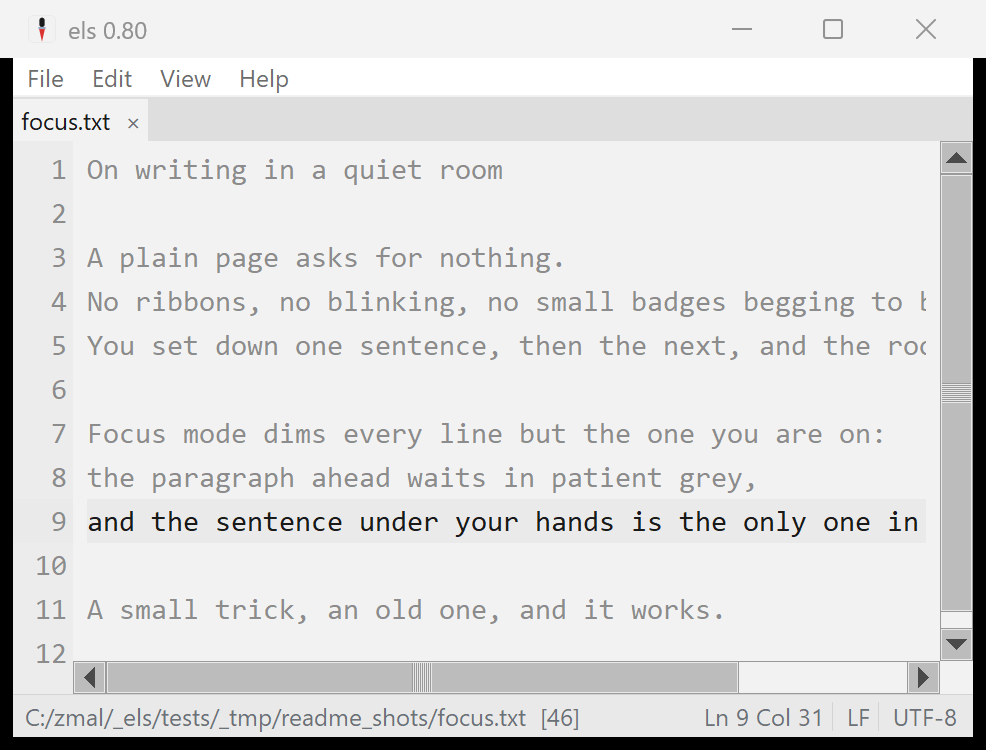

# els

A tiny text editor for Windows: calm, opinionated, no-frills.


els is a clean editor for everyday text files: multi-file tabs, find & replace
with real regex, word wrap, recent files, session restore, and charset
auto-detection. It is built never to lose text you have saved:
saves are atomic and durable, overwrites keep the file's previous version
as a backup (very large files aside), and optional auto-save can write for you (see
[Data safety](#data-safety)). It does not try to recover text you never saved — on
a crash that unsaved text is gone, by design, exactly as in a plain editor. The
look is deliberately quiet:
a calm grey page, flat chrome, and a single precise caret. It ships as a
self-contained native **`els.exe`** (~5.1 MB, zero non-system dependencies): a
real Windows executable with Tcl/Tk 9 and its C23 extensions compiled in.

The design is opinionated to the point of having few knobs: settings exist only
where they protect flow, such as wrap, recents, and session restore. The full
rationale (palette, typography, the find/replace
design, explicit non-goals) is in
[`docs/DESIGN.md`](docs/DESIGN.md), drawn from a study of EditPad Pro, Sublime
Text, Zed and iA Writer.

## Download

Grab the latest **`els.exe`** from the [Releases](../../releases) page. It's one
file, nothing to install. Releases are **code-signed** ("Open Source Developer
Vincent Vercauteren", via Certum); Windows SmartScreen may still warn on first
launch until that signature builds reputation — choose **More info → Run anyway**.

els keeps all of its application-managed runtime state beside the executable. Put `els.exe` in a
directory you can write to and keep its adjacent files and folders with it when
you move it. It never falls back to the user profile and deliberately ignores
old profile-stored els state. The complete inventory is under
[Data safety](#data-safety).

To make els open `.txt` and other plain-text files, open **Help > File
Associations...** and click **Register els with Windows**. That puts els in
Explorer's **Open with** menu (and in Settings > Default apps) without ever
seizing a default. Then right-click a file, pick **Open with > els**, and tick
**Always** to make it the default for that type. Manage or reset defaults anytime
in **Settings > Default apps**.

A full manual ships inside els — open it any time from **Help > Manual** (it opens
in your browser). Its source is [`resources/els-manual.html`](resources/els-manual.html).

## Features

- **Data safety, built in**: atomic, durable saves (an interrupted save leaves
  the original intact), previous-version backups on overwrite (very large files
  excepted, with a one-time note when one is skipped), and a guard
  against saves that would silently lose characters. Recovering text you never
  saved is a deliberate non-goal — a crash loses unsaved work, as in a plain
  editor. Explained in [Data safety](#data-safety).
- **Auto-save, opt-in** (File > Auto-save, off by default): documents that
  have a file are saved a moment after you begin editing, on tab switch, on
  focus loss, and on exit.
- **Backups, on by default** (File > Keep Backups): overwriting a file first
  preserves its previous version in a bounded `backups` folder next to
  `els.conf` (a burst of rapid saves keeps one pre-burst copy, not every save).
- **Multi-file tabs**: each document keeps its own undo, selection and dirty
  state under a flat tab strip; drag a tab to reorder. Same-named files gain the
  shortest distinguishing parent path, untitled documents are numbered, and
  compact marks show dirty (`•`) and decode-lossy (`�`) state.
  The active tab always remains visible; the right-hand overflow button (▾) and
  **Ctrl+T** open a switcher listing every open document, and Ctrl+Tab cycles.
- **Drag and drop**: drop files from Explorer onto the text area to open each in
  its own tab.
- **Find & replace** (Ctrl+F / Ctrl+H): Tcl ARE regex with live match
  highlighting, Match Case / Whole Word / Regex, backreferences, an adapt-case
  replace, search history, a wrapped-search indicator, and a built-in regex
  reference. Work runs in a cancellable isolated process: the first 5,000
  matches are highlighted, navigation continues through the global result index
  (up to its 1,000,000-match safety ceiling), zero-width matches are supported,
  and Replace All commits atomically as one undo step.
- **Large-file guard**: an interactive open or reload asks before reading more
  than 40 MiB, and refuses a file so large it would exhaust memory and crash. A
  large or network file met during startup or session restore opens as a
  **placeholder tab** (an unloaded tab, shown with a `○`) that loads when you
  click it — so launch never freezes or blocks on a share, and nothing is lost.
- **Text commands** (Buffer menu): a curated, undo-atomic set — move lines up/down
  (Alt+↑/↓), duplicate (Ctrl+D), delete (Ctrl+Shift+K), join (Ctrl+J), indent /
  dedent (Tab / Shift+Tab), sort / sort-descending / reverse / remove-duplicate
  lines, UPPERCASE / lowercase, and trim trailing whitespace.
- **Encoding & EOL**: auto-detected on open and preserved on save (mixed line
  endings are normalized to one style), shown in the
  status bar. All 95 Tcl encodings, BOM sniffing (UTF-8/16/32), and
  chardet-quality detection via the Windows system ICU. Click the encoding or
  EOL indicator to reopen-with / convert; new files use Windows line endings
  (CRLF).
- **Word wrap** with a line-number gutter that stays aligned across wrapped
  lines (View > Line Numbers to toggle, remembered); current-line highlight.
- **Show Whitespace**: spaces, tabs and trailing whitespace in distinct subdued
  tints.
- **Focus Mode** (View > Focus Mode): dims every line but the one holding the
  caret for distraction-free writing; remembered across sessions.
- **Recent files & session restore**: a compact recent-files manager plus
  reopen-on-start, on by default.
- **Zoom** the text with Ctrl `+` / `-` / `0` or Ctrl+mouse-wheel, remembered
  across sessions (the font family is fixed: no picker, by design).
- **File associations**: **Help > File Associations...** registers els with
  Windows as an app that can open files (it never seizes a type's default). els
  then appears in Explorer's **Open with** menu; point any type at it with
  **Open with > Always**, and manage defaults in **Settings > Default apps**.
- **Update check** (on launch): els makes one anonymous HTTPS request to the
  GitHub Releases API to notice a newer version and light a status-bar hint if
  one exists. Nothing is sent but the request, it fails silently when offline,
  and it uses Windows' own `curl.exe`. Set the environment variable
  `ELS_NO_UPDATE_CHECK=1` to turn it off entirely.
- **Right-click menus**: a context menu on the text (Undo/Cut/Copy/Paste/Select
  All, plus Find, Go to Line, Reload from Disk, Copy Full Path and Open Containing
  Folder) and on tabs (Close, Copy Full Path, Open Containing Folder).
- **On-disk state**: the status bar distinguishes Not on disk, On disk, Changed
  on disk, Missing, Unavailable and Read-only. This is an early warning; every
  save still performs the authoritative conflict check.
- **Go to line**, **Reload from Disk**, **Always on Top**, window- and zoom-level
  persistence, executable-adjacent `els.conf`, the els look and the awl icon.

## Data safety

A text editor's one unforgivable failure is losing text you *saved*. els defends
the saved file with atomic, durable writes, keeps the previous version of every
file it overwrites, and can auto-save for you — all arming immediately from the
writable state directory beside `els.exe`, with no location chooser or profile
fallback. What els deliberately does **not** do is recover text you never saved:
on a crash or power loss that unsaved text is gone (see "No recovery of unsaved
text" below). Backups are sidecars, not writes into the open document; automatic
document writes happen only when you turn on **File > Auto-save**.

**Adjacent state inventory.** In a packaged run the directory containing
`els.exe` is the one and only state directory; a source run uses the directory
containing `els.tcl` instead.

- `els.conf` stores settings, window state, recents and session paths.
- `backups\` holds the bounded previous-version ring when backups are enabled.
- `els.log` and its one rotated generation, `els.log.1`, hold diagnostics.
- `.els-find\` is transient scratch for immutable find snapshots, isolated
  worker jobs, result indexes and staged replacements.

0.95 removed crash-recovery snapshots and the single-instance handoff, so there
are no longer any `swap\` or `handoff\` folders; a boot-time sweep deletes either
one left behind by a pre-0.95 install.

There is no profile fallback, migration or deletion. If `els.conf` does not yet
exist but an old **adjacent** `config.tcl` does, els makes a one-time copy to
`els.conf` and leaves the old file alone; this is the only legacy-state bridge.
Atomic writers also create
short-lived temporary sidecars, and a failed document replacement deliberately
retains the complete rescue copy beside that document and names it in the error.

**Atomic, durable save.** els never truncates the real file in place. A save
first writes the complete new content to a temporary file in the same folder,
then atomically replaces the target. For an existing file the packaged build
uses Windows' `ReplaceFileW`, which also preserves permissions, alternate data
streams such as the mark-of-the-web, and creation time when Windows can merge
them. Metadata-merge errors do not make the atomic replacement itself unsafe,
so in that rare case the new content wins but some metadata may not carry over.
A same-directory atomic rename covers a newly created target and the development
fallback. Only after replacement does els call `FlushFileBuffers` on the final
target, and it reports the save successful only when that durability check
succeeds.

If writing the temporary file or replacing the target fails, the original is
never opened for truncation. A complete temporary copy is retained and named in
the error when replacement itself fails. A durability error is necessarily
later: the target may already contain the new bytes, but els still reports the
save as failed and keeps the tab dirty until a retry is confirmed. Thus a lock,
long-path edge case, full disk, or device error fails safely instead of falling
back to a risky direct write.

**No recovery of unsaved text — by design.** Between saves, your unsaved changes
exist only in memory, which is exactly what a crash, a forced reboot, or a power
cut destroys. els deliberately does **not** try to recover them. For a minimal
editor, snapshotting every edit to a hidden sidecar — plus the liveness locks
needed to tell a live session's snapshots from a dead one's, plus the dialog that
reconciles them against the file on disk — is far more machinery, and more failure
surface, than the promise is worth. So on an abnormal exit, anything you had not
saved (yourself, or through auto-save) is gone, exactly as in a plain editor. What
protects your data instead is the rest of this section: saves are atomic and
durable, every overwrite keeps the file's previous version as a backup, and
optional auto-save writes real files for you. If you want a document to survive a
crash, save it — or turn on auto-save so that happens for you automatically.

**Independent windows.** Every launch is its own window with its own tabs; els has
no single-instance owner. Opening a file "with els" while els is already running
simply opens a second window. Because nothing is shared between windows and no
unsaved text is written to a sidecar, there is no lock or handoff machinery that
could get it wrong — and the only way two windows can disagree about a file is the
ordinary one: whoever saves last wins, and the on-disk change guard (below) warns
the other before it overwrites.

**Large and network files wait for you.** An interactive open or reload asks
before reading a file larger than 40 MiB (~5 s worst-case load), and flatly
refuses one so large it would run the process out of memory and take every other
unsaved tab down with it; for an open, both decisions come before a tab is
created. Startup arguments and session restore are deliberately quiet: if they
encounter a large file—or an obvious UNC/network path that could stall Tk's
single UI thread—they open it as a **placeholder tab**: a real tab, shown with a
`○`, whose content is not loaded. It reads zero bytes and never touches the
share at startup; click it (or press a key on it) and it loads then, in the
foreground, going through the same 40 MiB warning. A placeholder stays in the
saved session, so it never silently disappears from a future startup.

**No save is silently lossy.** A document's encoding is preserved on save,
and some encodings cannot represent every character you can type. When that
happens, els stops and asks: switch a non-UTF-8 document to UTF-8 (which keeps
all valid Unicode text), save anyway with substitute characters (your choice
is remembered for that document until you pick another encoding), or cancel.
If the document is already UTF-8, only substitution or cancellation can handle
an invalid internal character. The dialog names the first offending character
and where it is. A clean Save is a true byte-preserving no-op. If opening with
the wrong encoding already introduced replacement characters and you then edit
the document, saving requires a separate explicit confirmation; auto-save
pauses instead.

**Changed, missing, or unavailable on disk.** The active document's status-bar
indicator reports **Not on disk**, **On disk**, **Changed on disk**, **Missing**,
**Unavailable**, or **Read-only**. It is a quiet early-warning observer, not the
save authority: it never reloads, writes, pauses auto-save or asks a question.
Automatic observation also performs no I/O against obvious UNC/network paths,
where an offline server could freeze the UI; explicit open, reload and save are
the deliberate I/O points.

If another program rewrites or
removes a file while you have it open — a branch switch, formatter, sync client,
or disconnected drive — saving would otherwise quietly destroy or recreate
external state. Every save performs a fresh, full conflict check regardless of
what the early-warning label currently says. A changed file offers overwrite,
reload, or cancel; a missing or unreadable target requires explicit confirmation
before els attempts to recreate or overwrite it. Auto-save never prompts: it
pauses that document with a quiet statusbar note until a manual save settles the
conflict. A read-only or locked target fails safely and stays dirty. **File >
Reload from Disk** re-reads the current file from disk at any time.

**Previous versions (backups).** Saving is the one moment els overwrites
your data with new content, so a save that replaces an existing file
first preserves what the file held, as a plain copy in a `backups` folder
next to `els.conf`, and therefore next to `els.exe` in a packaged run.
The folder is bounded, not an archive: a handful of versions per file, a
burst of rapid saves keeps the version from before the burst rather than
churning, very large files are skipped, and copies age out after about a
month. Restoring is deliberately low-tech: **File > Open Backups Folder**,
open the version you want (the name carries the original filename and a
timestamp), and save it where it belongs. Backups never block a save: if one
cannot be written, you get a quiet statusbar note and the save proceeds.
**File > Keep Backups** turns the whole thing off; worth knowing either way
is that copies of edited files linger there until they age out, including
files you later delete or move.

**Auto-save (optional).** **File > Auto-save** is off by default. When you
turn it on, every document that has a file is saved automatically: a moment
after you begin editing, when you switch tabs, when the els window loses focus,
and when you close a file or exit, always through the same atomic save.
Untitled notes are never auto-saved — no filename is invented, so with no crash
recovery their text is simply not on disk until you save it with a name. A save
that would lose characters pauses auto-saving for that document until one manual
save settles the question, an on-disk conflict likewise waits for a manual save,
and a failing auto-save shows a quiet statusbar note instead of a dialog. With
auto-save on, the file
on disk follows the buffer, so closing without saving stops being a way to
discard an editing accident; the backups folder above is what makes such an
accident recoverable anyway.




## Requirements & limitations

Stated plainly so you know before you rely on it:

- **Windows 10 (version 1903 or newer) or Windows 11, 64-bit.** els leans on the
  per-application UTF-8 code page (Windows 10 1903+) for correct handling of
  non-ASCII file paths, and on long-path awareness (Windows 10 1607+). The
  manifest still lists Windows 7/8.1 for compatibility and els may launch there,
  but those are untested and path handling degrades without the UTF-8 code page.
  There is no 32-bit build.
- **A writable directory for `els.exe`.** Settings, the deferred-open queue,
  backups, find-worker scratch and diagnostics are
  intentionally stored beside the executable, never in the user profile. A
  read-only application directory prevents those facilities from persisting;
  move els and its adjacent state to a writable directory.
- **Not accessible to screen readers.** els draws its own text surface on Tk,
  which does not expose UI Automation to assistive technology, so Narrator, NVDA
  and JAWS cannot read or navigate a document's text. If you rely on a screen
  reader, els is not a usable editor for you today, and that is an honest gap
  rather than a setting to find. els does not add an assistive-technology layer.
- **No right-to-left text shaping.** The same Tk text engine does no Unicode
  bidirectional reordering, so Arabic, Hebrew and mixed-direction text displays in
  logical rather than visual order. Another inherited Tk limitation, disclosed here.
- **Very long lines are refused.** els won't open a file that contains a line
  longer than ~50,000 characters (e.g. minified JS/CSS/JSON, or a single-line data
  blob). A line that long freezes Tk's text widget — one *horizontal* scroll of a
  250 KB line can block the UI for minutes, and the cost grows quadratically — so
  rather than degrade, els declines with a clear message, the same way it refuses a
  file too large to fit in memory. An inherited Tk-text-widget limit; opening these
  files smoothly would need a virtualized renderer, which is out of scope today.
- **Single, fixed appearance.** No settings UI: colours, fonts and the caret are
  not configurable by design (see [docs/DESIGN.md](docs/DESIGN.md)). No syntax
  highlighting and no minimap. els ships one hand-tuned light palette (already past
  WCAG AAA contrast) and does not follow the Windows dark-mode or High-Contrast theme.

## Toolchain & tasks

`els` is hosted under `C:\dev\_els`. z is the public front door: the
committed `z.json` drives `tools/tasks.tcl` with z's `tclsh90`, and els builds
against z's shared runtime payloads under `<z>/.z/r` — it carries no
project-local toolchain. No project-local launcher script is tracked.

```
z tasks           # list tasks
z run [file...]   # launch the editor
z test            # in-process test suite (tcltest + Tk event generate)
z shot out.png    # screenshot the editor (twapi, all-Tcl, no AutoIt)
z readme-shots    # regenerate the README screenshots
z probe-exe [exe] # process-level startup checks (defaults to released dist/els.exe)
z build [out]     # development build -> build/els-dev.exe (or another build/*.exe)
z release-check   # fail-closed clean build/test/probe -> dist/els-unsigned.exe
z sign            # verify, sign, re-probe and promote -> dist/els.exe
z pecheck         # verify PE/manifest/mitigation/certificate-table policy
                  # (z sign separately verifies Authenticode identity + timestamp)
z build-ext       # compile the five loadable C23 modules -> build/*.dll
z native-startup-check # prove native initialization failures stop before Tcl UI
z check           # check z's runtime payloads (--deep runs functional probes)
z tasks env       # show the resolved payload roots
```

From the z workspace root, use `z in els <command>`, for example `z in els test`.

`z build` produces one self-contained native development exe (~5.1 MB, zero non-system
DLLs): a real Windows PE with our own C23 `WinMain`, Tcl + Tk + the charset
detector statically linked in, and `els.tcl` + the Tcl/Tk script libraries riding
inside an appended `zipfs` image (`els.tcl` itself is unchanged). The PE icon,
manifest, and version info are baked in via `windres`.

Development and release artifacts are deliberately separate. `z build` writes
`build/els-dev.exe` by default; an optional output must still be an `.exe` below
`build/`. **`dist/els.exe` is release-only** and is written solely by the signing
gate. A rebuild stages the new development exe before replacing it and preserves
the previous one if replacement fails. Users only need the released `els.exe`;
developers need the repo plus a hydrated z workspace tree (`<z>/.z/r`).

Release artifacts do not come directly from that development build. A clean
`z release-check` runs the complete no-skip test suite, native checks, packaging
and process probes, a forced native-initialization failure check, PE policy
checks, byte-exact embedded source/runtime/license verification, and a
source-state consistency check before publishing the fixed
`dist/els-unsigned.exe` set with `.sha256` and `.provenance.txt` sidecars. The
provenance is re-read and recomputed from the artifact, clean Git tree, compiler
and header trees, exact linker map and link inputs, packaging tools, and notice
sources before promotion. `z sign`
accepts only that verified set (or its `build/release-check` no-promotion twin),
performs a clean rebuild and requires its unsigned executable and recorded link
evidence to reproduce exactly before any signing operation,
requires the source-pinned publisher
**Open Source Developer Vincent Vercauteren** (optionally tightened with
`ELS_SIGN_CERT_SHA1`), requires a verified RFC 3161 timestamp, re-runs PE and
process checks on the signed candidate, then promotes and post-verifies the
executable and both sidecars at the fixed `dist/els.exe` path. Publication is
sidecars-first and executable-last, with an on-disk journal that restores the
previous release-set state after an interrupted process or reconciles a completed
publication on the next attempt. The executable
embeds the els MIT license plus the applicable Tcl, Tk, MinGW-w64 runtime, GCC
GPLv3/runtime-exception, zlib, and LibTomMath notices verbatim from their source files.

The project uses **only C and Tcl 9** for durable tooling. Avoid adding bash,
PowerShell, Python, `.bat`, `.cmd`, or `.ps1` glue; use `z` commands
instead. See
[`toolchain.md`](toolchain.md) for the full setup.

z's shared runtime (`<z>/.z/r`) provides Tcl/Tk 9, the UCRT64 gcc/C23, twapi,
the static Tcl/Tk libraries, the packaging script libraries, and the Tcl/Tk 9
manual. `z check` reports the components els uses; `z check --deep` runs
functional checks. There are no project-local fetch/prep tasks.

## C extensions (C23)

els can drop into **C23** for hot paths or to bind a C library, exposed to Tcl
as ordinary commands. The product build compiles `src/icudet.c`, `src/winfs.c`,
and `src/windrop.c` as ordinary static objects and registers them from the
`Tcl_AppInit` in `src/els_main.c`; `src/els_main.c` is the executable entry point,
not a loadable module. For development and tests, `z build-ext` separately builds
the five loadable modules (`cap`, `elsx`, `icudet`, `winfs`, and `windrop`) as Tcl
stubs DLLs under `build/`. `cap` and `elsx` are development/test helpers and are
not linked into the product. A real product example,
**`src/icudet.c`**, dynamically loads the Windows system ICU (`icu.dll`) to expose
its charset detector to Tcl (the basis of els's encoding auto-detection); it is
compiled into the shipped exe together with **`src/winfs.c`**, the Win32 helper
behind atomic saves (ReplaceFileW + FlushFileBuffers) and the isolated find/replace
worker, and **`src/windrop.c`**, the Explorer drag-and-drop handler. Tests live in
`tests/elsx.test` and `tests/winfs.test`.

## About


els = Dutch for *awl*, a small, sharp tool. It's a single-file Windows editor;
the source and the build recipe are both in this repo, so you can read it, fork
it, or build it yourself. Currently **v0.97**: a complete editor, polishing toward 1.0.

Built on **Tcl/Tk 9.0.4**. The About dialog acknowledges Tcl/Tk 9, MinGW-w64,
GCC, zlib and LibTomMath, with thanks to their maintainers and communities.
© 2026 Vincent Vercauteren. **MIT** licensed; see [`LICENSE`](LICENSE).
Released executables keep the full legal text in embedded `LICENSE.txt` and
`THIRD-PARTY-NOTICES.txt`, including the verbatim Tcl, Tk, MinGW-w64 runtime,
GCC GPLv3/runtime-exception, zlib, and LibTomMath terms.
