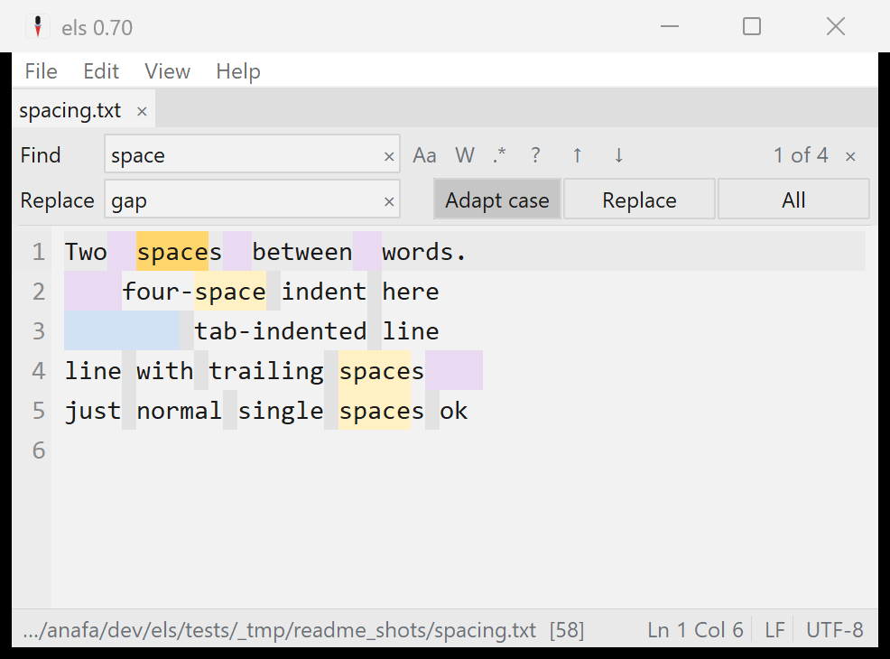
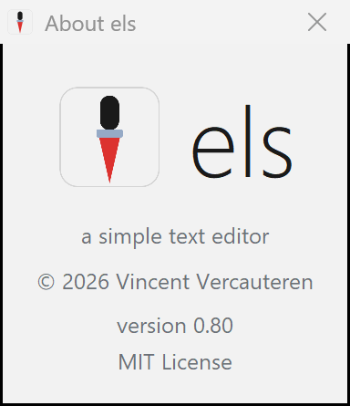

# els

A tiny text editor for Windows: calm, opinionated, no-frills.


els is a clean editor for everyday text files: multi-file tabs, find & replace
with real regex, word wrap, recent files, session restore, and charset
auto-detection across 95 encodings. It is built to never lose your text:
saves are atomic, unsaved work is continuously crash-protected, and opening a
file while els is running joins the existing window instead of spawning a
second one (see [Data safety](#data-safety)). The look is deliberately quiet:
a calm grey page, flat chrome, and a single precise caret. It ships as a
self-contained native **`els.exe`** (~5.1 MB, zero non-system dependencies): a
real Windows executable with Tcl/Tk 9 and its C23 extensions compiled in.

The design is opinionated to the point of having few knobs: settings exist only
where they protect flow, such as wrap, recents, session restore, and where to
keep `els.conf`. The full rationale (palette, typography, the find/replace
design, explicit non-goals) is in
[`docs/DESIGN.md`](docs/DESIGN.md), drawn from a study of EditPad Pro, Sublime
Text, Zed and iA Writer.

## Download

Grab the latest **`els.exe`** from the [Releases](../../releases) page. It's one
file, nothing to install. Releases are **code-signed** ("Open Source Developer
Vincent Vercauteren", via Certum); Windows SmartScreen may still warn on first
launch until that signature builds reputation — choose **More info → Run anyway**.

To make els open `.txt` and other plain-text files, open **Help > File
Associations...** and click **Register els with Windows**. That puts els in
Explorer's **Open with** menu (and in Settings > Default apps) without ever
seizing a default. Then right-click a file, pick **Open with > els**, and tick
**Always** to make it the default for that type. Manage or reset defaults anytime
in **Settings > Default apps**.

## Features

- **Data safety, built in**: atomic saves that cannot truncate a file,
  continuous crash protection for unsaved changes, a guard against saves that
  would silently lose characters, and one editor window that collects
  everything you open. Explained in [Data safety](#data-safety).
- **Auto-save, opt-in** (File > Auto-save, off by default): documents that
  have a file are saved a moment after you stop typing, on tab switch, on
  focus loss, and on exit.
- **Backups, on by default** (File > Keep Backups): every save that
  overwrites a file first preserves the previous version in a bounded
  `backups` folder next to `els.conf`.
- **Multi-file tabs**: each document keeps its own undo, selection and dirty
  state under a flat tab strip; drag a tab to reorder.
- **Drag and drop**: drop files from Explorer onto the text area to open each in
  its own tab.
- **Find & replace** (Ctrl+F / Ctrl+H): Tcl ARE regex with live match
  highlighting, Match Case / Whole Word / Regex, backreferences, an adapt-case
  replace, search history, a wrapped-search indicator, and a built-in regex
  reference.
- **Encoding & EOL**: auto-detected on open, preserved on save, shown in the
  status bar. All 95 Tcl encodings, BOM sniffing (UTF-8/16/32), and
  chardet-quality detection via the Windows system ICU. Click the encoding or
  EOL indicator to reopen-with / convert; new files use Windows line endings
  (CRLF).
- **Word wrap** with a line-number gutter that stays aligned across wrapped
  lines (View > Line Numbers to toggle, remembered); current-line highlight.
- **Show Whitespace**: spaces, tabs and trailing whitespace in distinct subdued
  tints.
- **Focus Mode** (View > Focus Mode): dims every line but the one holding the
  caret for distraction-free writing; remembered across sessions.
- **Recent files & session restore**: a compact recent-files manager plus
  reopen-on-start, on by default.
- **Zoom** the text with Ctrl `+` / `-` / `0` or Ctrl+mouse-wheel, remembered
  across sessions (the font family is fixed: no picker, by design).
- **File associations**: **Help > File Associations...** registers els with
  Windows as an app that can open files (it never seizes a type's default). els
  then appears in Explorer's **Open with** menu; point any type at it with
  **Open with > Always**, and manage defaults in **Settings > Default apps**.
- **Update check** (on launch): els makes one anonymous HTTPS request to the
  GitHub Releases API to notice a newer version and light a status-bar hint if
  one exists. Nothing is sent but the request, it fails silently when offline,
  and it uses Windows' own `curl.exe`. Set the environment variable
  `ELS_NO_UPDATE_CHECK=1` to turn it off entirely.
- **Right-click menus**: a context menu on the text (Undo/Cut/Copy/Paste/Select
  All, plus Find, Go to Line, Reload from Disk, Copy Full Path and Open Containing
  Folder) and on tabs (Close, Copy Full Path, Open Containing Folder).
- **Go to line**, **Reload from Disk**, **Always on Top**, window- and zoom-level
  persistence, portable/profile `els.conf`, the els look and the awl icon.

## Data safety

A text editor's one unforgivable failure is losing text. els defends against
that with a set of mechanisms that work together. None of them needs setup, and
none of them ever writes into your files on its own.

**Atomic save.** els never overwrites a file in place. A save first writes the
complete new content to a temporary file in the same folder; only when every
byte is on disk does it swap the temporary file over the original, in one
atomic step (Windows' `ReplaceFileW`, which also carries over the file's
permissions, alternate data streams such as the mark-of-the-web, and creation
time). The old in-place style of saving has a failure window: if the process
dies or the disk fills after a file has been truncated but before the new
content lands, the file is simply gone. With atomic save that window does not
exist. A save either fully succeeds or leaves the original exactly as it was;
the worst a crash mid-save can cost you is that one save attempt.

**Crash recovery.** Between saves, your unsaved changes exist only in memory,
which is exactly what a crash, a forced reboot, or a power cut destroys. So
while you edit, els continuously snapshots every modified document into a
small swap file (in a `swap` folder next to `els.conf`): a snapshot is taken
about every two seconds, and shortly after each pause in typing. Documents
with nothing unsaved have no swap file; saving or closing a document removes
its snapshot, because the file on disk is then the truth. If els ends
abnormally, those snapshots survive. The next start detects them, checks each
against the current file on disk, and offers everything in one dialog. Each
item you choose to recover opens as an ordinary unsaved tab, marked
"(recovered)", for you to inspect and then save or discard. Recovery never
touches the files themselves; it only brings text back into the editor, and it
tells you when a file changed on disk since the snapshot so you can decide
which version wins. Untitled notes that were never saved anywhere are
protected the same way. Snapshots are also crash-consistent themselves: they
are written atomically and verified with a checksum, so a half-written
snapshot is discarded rather than trusted.

**Single instance.** Opening a file "with els" while els is already running
does not start a second editor. The new launch notices the running one, hands
the file over, and exits; your existing window opens it as a new tab and comes
to the front. One window means one session, one recent-files list, and one
place where unsaved work lives, which keeps the two mechanisms above simple
and predictable. The handoff is also why two instances cannot quietly fight
over the same file with last-save-wins. If you deliberately want independent
instances, set the environment variable `ELS_NO_SINGLE_INSTANCE=1` for the
extra launch: the safety layer was designed for that case too, so each
instance keeps its own protected snapshots (a live instance's snapshots are
guarded by a lock that Windows releases only when that process is truly
gone, so one instance can never "recover" another's open work).

**No save is silently lossy.** A document's encoding is preserved on save,
and some encodings cannot represent every character you can type. When that
happens, els stops and asks: switch the document to UTF-8 (keeps every
character), save anyway with substitute characters (your choice is remembered
for that document until you pick another encoding), or cancel. The dialog
names the first offending character and where it is.

**Changed on disk.** If another program rewrites a file while you have it open
— a branch switch, a formatter, a sync client — saving would otherwise quietly
overwrite that change. els notices before it writes: a manual save stops and
offers to overwrite, reload the file, or cancel, and auto-save pauses that
document (with a quiet statusbar note) until you decide. **File > Reload from
Disk** re-reads the current file from disk at any time.

**Previous versions (backups).** Saving is the one moment els overwrites
your data with new content, so every save that replaces an existing file
first preserves what the file held, as a plain copy in a `backups` folder
next to `els.conf` (for a portable install that is right next to `els.exe`).
The folder is bounded, not an archive: a handful of versions per file, a
burst of rapid saves keeps the version from before the burst rather than
churning, very large files are skipped, and copies age out after about a
month. Restoring is deliberately low-tech: **File > Open Backups Folder**,
open the version you want (the name carries the original filename and a
timestamp), and save it where it belongs. Backups never block a save: if one
cannot be written, you get a quiet statusbar note and the save proceeds.
**File > Keep Backups** turns the whole thing off; worth knowing either way
is that copies of edited files linger there until they age out, including
files you later delete or move.

**Auto-save (optional).** **File > Auto-save** is off by default. When you
turn it on, every document that has a file is saved automatically: a moment
after you stop typing, when you switch tabs, when the els window loses focus,
and when you close a file or exit, always through the same atomic save.
Untitled notes are never auto-saved (no filename is invented; crash recovery
protects them), a save that would lose characters pauses auto-saving for that
document until one manual save settles the question, and a failing auto-save
shows a quiet statusbar note instead of a dialog. With auto-save on, the file
on disk follows the buffer, so closing without saving stops being a way to
discard an editing accident; the backups folder above is what makes such an
accident recoverable anyway.



## Requirements & limitations

Stated plainly so you know before you rely on it:

- **Windows 10 (version 1903 or newer) or Windows 11, 64-bit.** els leans on the
  per-application UTF-8 code page (Windows 10 1903+) for correct handling of
  non-ASCII file paths, and on long-path awareness (Windows 10 1607+). The
  manifest still lists Windows 7/8.1 for compatibility and els may launch there,
  but those are untested and path handling degrades without the UTF-8 code page.
  There is no 32-bit build.
- **Not accessible to screen readers.** els draws its own text surface on Tk,
  which does not expose UI Automation to assistive technology, so Narrator, NVDA
  and JAWS cannot read or navigate a document's text. If you rely on a screen
  reader, els is not a usable editor for you today, and that is an honest gap
  rather than a setting to find. Text zoom (Ctrl `+` / `-` / `0`) and a fixed
  high-legibility theme with a non-blinking caret are what els does offer.
- **Single, fixed appearance.** No settings UI: colours, fonts and the caret are
  not configurable by design (see [docs/DESIGN.md](docs/DESIGN.md)). No syntax
  highlighting and no minimap.

## Toolchain & tasks

`els` is hosted under `C:\zmal\_els`. zmal is the public front door: the
committed `z.json` drives `tools/tasks.tcl` with zmal's `tclsh90`, and els builds
against zmal's shared runtime payloads under `<zmal>/r` — it carries no
project-local toolchain. No project-local launcher script is tracked.

```
z tasks           # list tasks
z run [file...]   # launch the editor
z test            # in-process test suite (tcltest + Tk event generate)
z shot out.png    # screenshot the editor (twapi, all-Tcl, no AutoIt)
z readme-shots    # regenerate the README screenshots
z probe-exe       # process-level startup checks for the built exe (dist/els.exe)
z build           # build the native exe -> dist/els.exe
z build-ext       # compile src/*.c C23 extensions -> build/*.dll
z check           # check zmal's runtime payloads (--deep runs functional probes)
z tasks env       # show the resolved payload roots
```

From the zmal root, use `z in els <command>`, for example `z in els test`.

`z build` produces one self-contained native exe (~5.1 MB, zero non-system
DLLs): a real Windows PE with our own C23 `WinMain`, Tcl + Tk + the charset
detector statically linked in, and `els.tcl` + the Tcl/Tk script libraries riding
inside an appended `zipfs` image (`els.tcl` itself is unchanged). The PE icon,
manifest, and version info are baked in via `windres`.

Build artifacts have exactly one home: **`dist/els.exe`** is the final exe (the
one you run, and the one a release ships), while `build/` holds compiler
intermediates only and the repo root holds no binaries. A rebuild stages the new
exe and swaps it into place, so it works even while `dist/els.exe` is running
(the old copy is parked as `els.exe.old` until the next build; restart els to
pick up the new one). Users only need the released `els.exe`; developers need
the repo plus a hydrated zmal tree (`<zmal>/r`).

The project uses **only C and Tcl 9** for durable tooling. Avoid adding bash,
PowerShell, Python, `.bat`, `.cmd`, or `.ps1` glue; use zmal `z` commands
instead. See
[`toolchain.md`](toolchain.md) for the full setup.

zmal's shared runtime (`<zmal>/r`) provides Tcl/Tk 9, the UCRT64 gcc/C23, twapi,
the static Tcl/Tk libraries, the packaging script libraries, and the Tcl/Tk 9
manual. `z check` reports the components els uses; `z check --deep` runs
functional checks. There are no project-local fetch/prep tasks.

## C extensions (C23)

els can drop into **C23** for hot paths or to bind a C library, exposed to Tcl
as ordinary commands. The native `els.exe` **statically links its extension in**
(via the `Tcl_AppInit` in `src/els_main.c`); in development each `src/*.c` also
builds as a stubs `.dll` (`z build-ext`; see `src/elsx.c`). A real example,
**`src/icudet.c`**, dynamically loads the Windows system ICU (`icu.dll`) to expose
its charset detector to Tcl (the basis of els's encoding auto-detection); it is
compiled into the shipped exe together with **`src/winfs.c`**, the Win32 helper
behind atomic saves and the crash-recovery liveness locks. Tests live in
`tests/elsx.test` and `tests/winfs.test`.

## About



els = Dutch for *awl*, a small, sharp tool. It's a single-file Windows editor;
the source and the build recipe are both in this repo, so you can read it, fork
it, or build it yourself. Currently **v0.80**: a working editor, evolving.

Built on **Tcl/Tk 9.0.3**. © 2026 Vincent Vercauteren. **MIT** licensed; see
[`LICENSE`](LICENSE).
