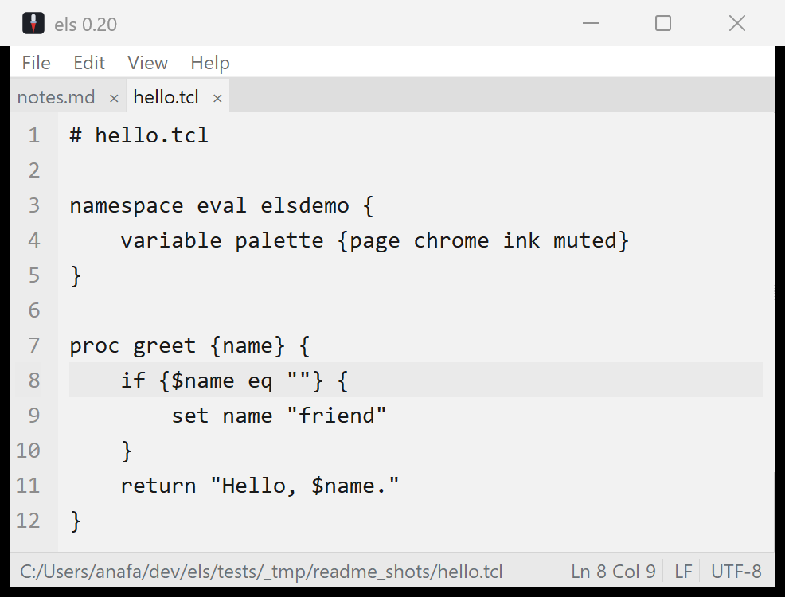
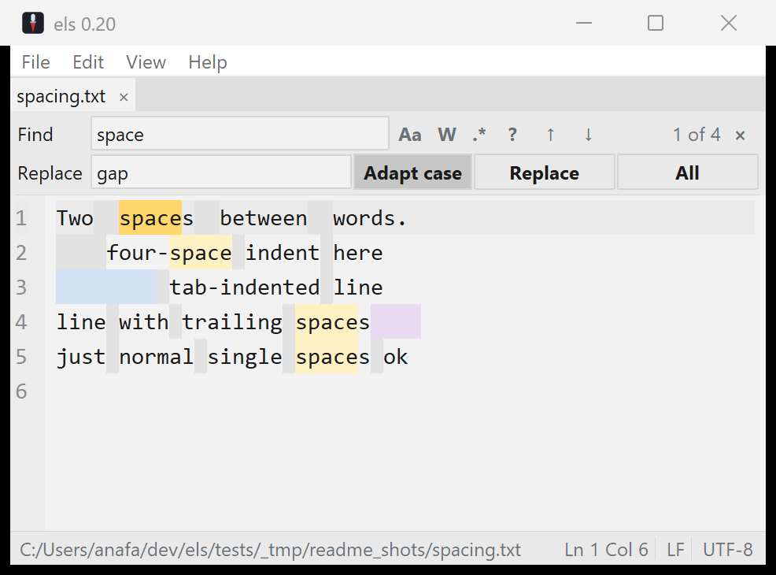
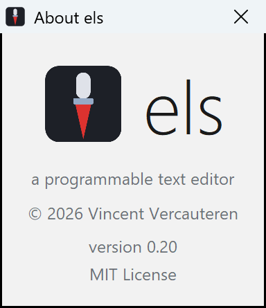

# els

A tiny, programmable text editor for Windows: calm, opinionated, no-frills.



els is a clean editor for everyday text files: multi-file tabs, find & replace
with real regex, word wrap, recent files, session restore, and charset
auto-detection across 95 encodings. The look is deliberately quiet: a calm grey
page, flat chrome, and a single precise caret. It ships as a self-contained
**`els.exe`** (~5.8 MB, zero non-system dependencies), built on Tcl/Tk 9 with a
C23 extension or two for the parts that need them.

The design is opinionated to the point of having few knobs: settings exist only
where they protect flow, such as wrap, recents, session restore, and where to
keep `els.conf`. The full rationale (palette, typography, the find/replace
design, explicit non-goals) is in
[`docs/DESIGN.md`](docs/DESIGN.md), drawn from a study of EditPad Pro, Sublime
Text, Zed and iA Writer.

## Download

Grab the latest **`els.exe`** from the [Releases](../../releases) page. It's one
file, nothing to install. It's unsigned, so Windows SmartScreen may warn on
first launch: choose **More info → Run anyway**.

## Features

- **Multi-file tabs**: each document keeps its own undo, selection and dirty
  state under a flat tab strip.
- **Find & replace** (Ctrl+F / Ctrl+H): Tcl ARE regex with live match
  highlighting, Match Case / Whole Word / Regex, backreferences, an adapt-case
  replace, search history, and a built-in regex reference.
- **Encoding & EOL**: auto-detected on open, preserved on save, shown in the
  status bar. All 95 Tcl encodings, BOM sniffing (UTF-8/16/32), and
  chardet-quality detection via the Windows system ICU. Click the encoding or
  EOL indicator to reopen-with / convert.
- **Word wrap** with a line-number gutter that stays aligned across wrapped
  lines; current-line highlight.
- **Show Whitespace**: spaces, tabs and trailing whitespace in distinct subdued
  tints.
- **Recent files & session restore**: a compact recent-files manager plus
  reopen-on-start, on by default.
- **Zoom** the text with Ctrl `+` / `-` / `0` or Ctrl+mouse-wheel (the font
  family is fixed: no picker, by design).
- **Go to line**, window-geometry persistence, portable/profile `els.conf`, the
  els look and the awl icon.



## Toolchain & tasks

The project is **fully self-contained**: a vendored Tcl/Tk 9, the gcc/C23
toolchain (MSYS2 UCRT64), and twapi all live under `.toolchain/`, so the folder
is copy-paste portable to any Windows 11+ machine: no installs, no system
dependencies. One **ignition script**, `x.cmd`, puts the vendored toolchain on
PATH (relative to itself) and hands off to a Tcl task runner; everything else is
Tcl or C.

```
x help          # list tasks
x run [file...] # launch the editor
x test          # in-process test suite (tcltest + Tk event generate)
x shot out.png  # screenshot the editor (twapi, all-Tcl, no AutoIt)
x readme-shots  # regenerate the README screenshots
x probe-exe     # process-level startup checks for the fused exe
x build         # fuse the single-file els.exe (--with-ext embeds build/*.dll)
x build-ext     # compile src/*.c C23 extensions -> build/*.dll
x toolcheck     # check the vendored toolchain (--prep fetches what's missing)
x shell         # a shell with the vendored toolchain on PATH
x env           # show the resolved toolchain
```

`x build` produces one self-contained `els.exe` (~5.8 MB, zero non-system DLLs)
by fusing `els.tcl` + Tcl/Tk into a `zipfs` image on a static interpreter;
`x build --with-ext` also embeds any compiled C extension so it loads from
inside the exe. Users only need the resulting `els.exe`; developers can move the
whole repo folder around because the vendored `.toolchain/` is relocatable.

The project uses **only C and Tcl 9**, plus one classical-`cmd` boot script
(`x.cmd`): no bash, PowerShell, or Python. See
[`toolchain.md`](toolchain.md) for the full setup.

The toolchain (Tcl/Tk 9, gcc/C23, twapi, MinGit) lives under `.toolchain/` and is
**relocatable**, verified by copying the folder to a different path and
rebuilding + testing from there. `x toolcheck` reports each component; `x
toolcheck --prep` fetches the auto-installable pieces (twapi, git) on a freshly
cloned checkout. Everyday commands only fast-check the one or two tools they
need, so they stay instant.

## C extensions (C23)

els can drop into **C23** for hot paths or to bind a C library, exposed to Tcl
as ordinary commands. Extensions build against the Tcl *stubs* (compiler-
independent, system-DLL-only) with the vendored gcc; see `src/elsx.c`. They can
load dynamically (`package require`) or be embedded in the single-file `els.exe`
via its `zipfs` image. `x build-ext` compiles them; tests live in
`tests/elsx.test`. A real example, **`src/icudet.c`**, dynamically loads the
Windows system ICU (`icu.dll`) to expose its charset detector to Tcl: the
basis of els's encoding auto-detection.

## About



els = Dutch for *awl*, a small, sharp tool. It's a single-file Windows editor;
the source and the build recipe are both in this repo, so you can read it, fork
it, or build it yourself. Currently **v0.20**: a working editor, evolving.

Built on **Tcl/Tk 9.0.3**. © 2026 Vincent Vercauteren. **MIT** licensed; see
[`LICENSE`](LICENSE).
